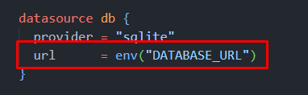

# store-inventory-server (api)


## instructions

1. run npm install command

    ```js
    npm install
    ```
2. Make sure to have `DATABASE_URL` as environment variable 
    ```
    DATABASE_URL="file:./dev.db"
    ```
    to simplify up you can copy this line to `prisma/schema.prisma` to the `url` prop, Like indicated in the img below:

    

3. run the following command to get prisma cli installed
    ```js
    npx prisma
    ```

4. run the following command so Prisma will create an SQLite db in the path specified at the .env file
    ```js
    npx prisma migrate dev
    ```

5. run npm start 
    ```js
    npm start
    ```

3. The server-api is ready at `localhost:4000`
